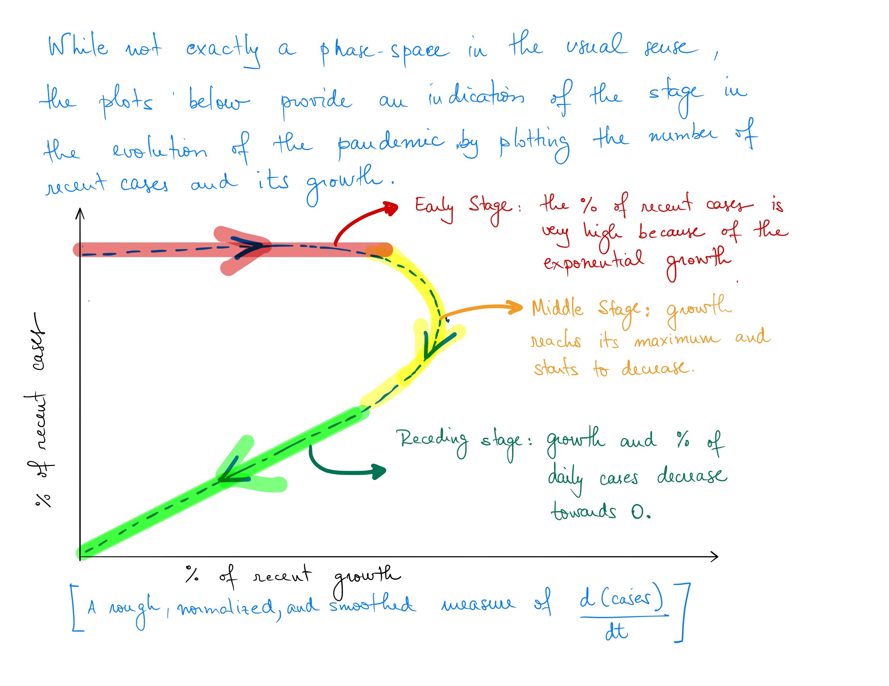

# Phase space for Covid 2020

Jupyter notebook with the calculcations for the COVID phase space, with results plotted in Plotly. Further details at the <a href="https://ufran.ca/phase_space_COVID/">main webpage.</a>

</img>
